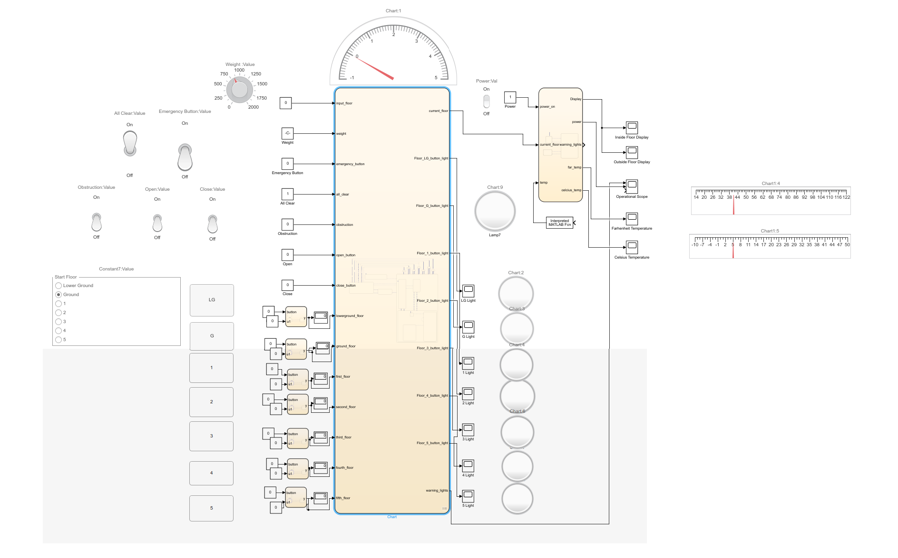

# ES2D7 Simulating a Lift

*A project that involved developing the necessary features for a lift using MATLAB and SimuLink*

## About the Project

This project was undertaken in early-2019. In a small group, we were tasked to use an Agile management framework, starting first with creating requirements and assessing various features using Kano models, Pugh Matrices and multi-criteria graphs. Having decided on the features, we each member of the group chose a feature to develop, and we integrated them at the end.

The following features were developed:
 - Door functionality
 - Emergency stop button
 - Exceed weight limit
 - Lift order priority
 - Multi-floor input
 - Announcer
 - Display screen with current temperature
 - Elevator music
 - Button lights

The model can be seen below...

## Usage

Requires MATLAB and SimuLink